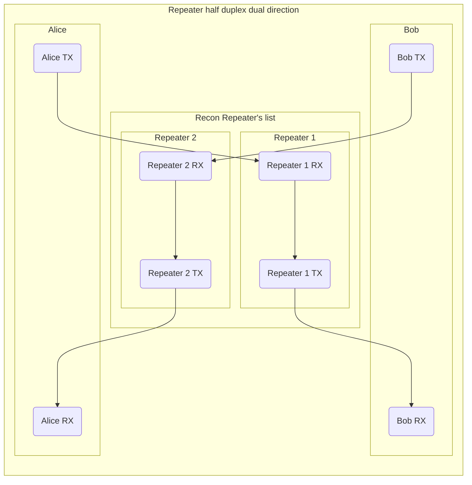

# Recon App

- [Recon App](#recon-app)
  * [Important note](#important-note)
  * [Introduction](#introduction)
    + [In AM/NFM/WFM mode](#in-am-nfm-wfm-mode)
    + [In SPEC mode](#in-spec-mode)
  * [Limitations](#limitations)
- [TODO first](#todo-first)
  * [Common defaults options to set](#common-defaults-options-to-set)
- [Main Screens](#main-screens)
- [CONFIG](#config)
  * [Main RECON settings page](#main-recon-settings-page)
  * [More CONFIG settings page](#more-config-settings-page)
- [Recon/Search/Manual](#recon-search-manual)
  * [RECON mode](#recon-mode)
  * [SCAN mode](#scan-mode)
  * [MANUAL-S](#manual-s)
  * [Wait/lock Coloring conditions:](#wait-lock-coloring-conditions-)
- [Color meaning for main freq](#color-meaning-for-main-freq)
- [Wait modes](#wait-modes)
- [Lock counts](#lock-counts)
- [Matching modes](#matching-modes)
  * [Continuous](#continuous)
  * [Sparse](#sparse)
- [Frequencies to scan](#frequencies-to-scan)
- [Modulation Mode](#modulation-mode)
- [Persistant settings](#persistant-settings)
- [Freqman file format](#freqman-file-format)
- [HamRadio type](#hamradio-type)
- [Repeater type](#repeater-type)
  * [In Recon, when current type is Repeater and repeater mode is DISABLED:](#in-recon--when-current-type-is-repeater-and-repeater-mode-is-disabled-)
  * [In Recon, when current type is Repeater and repeater mode is ENABLED:](#in-recon--when-current-type-is-repeater-and-repeater-mode-is-enabled-)
  * [Advanced Repeater configuration](#advanced-repeater-configuration)
    + [Repeater half duplex dual direction example](#repeater-half-duplex-dual-direction-example)
    + [What are the possibilities](#what-are-the-possibilities)
- [Workflow and tips](#workflow-and-tips)
  * [Classic workflow](#classic-workflow)
  * [Repeater workflow:](#repeater-workflow-)
  * [Tips:](#tips-)
- [Troubleshooting](#troubleshooting)
- [Scan speed vs Chosen modulation mode](#scan-speed-vs-chosen-modulation-mode)
- [Power consumption](#power-consumption)

## Important note
Repeater and all associated repeat modes are under development. The documentations related to it are for devs/nightly testers. You will not yet find it in stable.

## Introduction
The Recon app is full rework of the Scanner app, offering different possibilities and customisations.

Both are using all the frequencies in their hand and pause on a frequency when matching criteria (like modulation, amplitude,...)

The Recon is using a different approach than the Scanner app it is originated from: it does not use a thread for frequency shifting and else rely on the statistics update event message to do the work. 

This allow perfect matching between 'shifting to a new frequency' and 'waiting for the first statistic update of that frequency'.
The Recon app will stop into any frequency carrying a signal strong enough. You can adjust the signal power threshold with the SQUELCH

### In AM/NFM/WFM mode
The statistics only update once each 100ms, the minimum lock waiting time is also 100 ms, and the quickest frequency scanned rate is 10/s.

### In SPEC mode
The statistics are updated differently in regard of the bandwidth used. 

The average locking times / scan rates are in the following the table (they may change when there are baseband or record process modifications)

* average of 10/s from 12.5k to 1500k
* average of 5/s from 1750k to 3000k 
* average of 3/s from 3000k to 5000k 

## Limitations
The portapack hardware is limited, and so is the list of elements that you can load. 

A maximum number of 115 elements is allowed. One more element is allowed to detect that the file was truncated.

If a file was loaded and truncated, the displayed list name and current entry description are in yellow instead of other colors.

# TODO first
If you are launching the Recon app for the first time, chances are high that you do not have the wanted options selected by default.

We highly encourage you to go and check what's under the "CONFIG" button and get yourself used to the 'Main' and 'More' pages under it.

## Common defaults options to set

Go into "CONFIG":

Main:

* Check input file and output file name

* Check options under it. A lots are complaining that the search is not starting by itself, but they do not have 'autostart recon' checked.

More:

* Check that 'input: load freqs' and 'input: load ranges' are checked

# Main Screens

Buttons and information description, from top to bottom, and left to right. [NAME] is used to mark a button / gui element that the user can change, else it's a description of an onscreen information.

* [LNA] , [VGA] , [AMP] , [VOL] => gains, amplification on/off , volume

* Current input file name =>  will be in yellow if file contain too much lines or red if an error description is shown, or follow mode colors

* Current entry description => input name, will be in yellow if file contain too much lines or red if an error description is shown, or follow mode colors 

* [RssiGraph], [MODE] => radio levels indication, jump to level app on click. Mode is one of [RECON/SCAN/MANUAL] and show actual mode, and switch to next mode on click

* [XXX] / XXX , XX db, XX/XX value => index of the current frequency in the loaded list (move with encoder, or set a value by clicking), number of frequencies in the list, actual DB value, number of locks / number of needed locks for a match, button to the settings page. Will be in red if file contain too much lines or if an error description is shown

* FREQ: XXXX , [LOOP] => Current frequency , [LOOP] button to control continuous mode or not (green is on, white is off)

* RSSI: XXX/XXX/XXX => Current min/med/max RSSI values in db

* TIMER, CTCSS, [CONFIG] => elapsed timer for current frequency lock (0 if no lock) , detected tone if NFM is selected, and CONFIG button to set things like input/output files 

* [START], [END], [SEARCH] => set the manual start and end of a range and launch a search on it. These values will be updated by the search if auto update m-ranges is checked. If highlighted, you can use the rotary encoder to adjust start or end

* [MatchMode] , [STEP] => Matching mode, manual range steps

* [NBLocks] , [W] , [L] => NBLocks is the numbers of locks we need to have a match. [W] (wait after match) is the time we will stay on the frequency if it's reaching nb_locks during lock_wait (continuously or sparsely). If wait is a negative number, then it represent the time we are staying on a matched frequency waiting for new activity, and a new lock during the wait restart the counters (you keep staying on it until a full wait without a lock is reached). [L] (lock duration) is the maximum time we stay on a freq waiting for all locks in SPARSE match mode, and the time we are waiting for the first lock in CONTINUOUS match mode.

* [MODULATION] , [BW] , [SQUELCH] => actual modulation and bandwidth ,squelch is the level of DB needed to start to lock on a signal 

* [PAUSE] , [AUDIO] , [STORE] => pause or resume the search. If highlighted, you can use the rotary encoder to manually step in the frequencies/ranges, jump to Audio App, store actual frequency in output file. Audio button is becoming red in auto record modes to indicate that a record in ongoing

* [FW], [RST], [MIC TX] , [REMOVE/DELETE] => forward/reverse , reset search (it's restarting from the beginning of input file), jump to Mic app, Remove a frequency from active/loaded list in RECON mode or Delete from both active/loaded list and output file in SCAN mode

# CONFIG 
## Main RECON settings page

* input file => File from which we will load frequencies or ranges to search (default FREQMAN/RECON.TXT)
* output file => File into which we will save frequency using STORE button or autosave mode (default FREQMAN/RECON_RESULTS.TXT)
* output file name => The name of the current output file. Can be edited when clicking on it so you can set a new filename
* autosave freqs => During the search, matching frequencies will be saved without clicking on STORE. No duplicates will be made
* auto start search => Search will start when entering the app, or when going in and out of CONFIG
* continuous => If checked then the search will loop when reaching boundaries of the loaded input file or the manual range search
* clear output at start => If checked then the output file is blanked at app start. If you're using that feature and want to keep one of your search results, do not forgot to go into filemanager to rename the file before starting the Recon app one more time

## More CONFIG settings page

One of the first two options have to be checked else nothing will be loaded at all and only manual range search will be available
* load freq => allow load of frequencies
* load repeater => allow load of frequencies
* load range => allow load of ranges
* load hamradio => allow load of ham radios
* auto update m-ranges => if checked then the manual range start and stop values are updated using the actual searched range values. If it's actually searching a frequency, manual ranges are untouched
* record locked period=> activate auto record during locked wait (green) state. In audio modes, a wav file with actual time of capture as filename is created in AUDIO directory. In SPEC mode, a raw c16 with actual time of capture as filename is created in CAPTURES directory. 
* repeater => activate repeat function.  nb => number of repetitions  
* amp => enable/disable amp when TX repeat is on.  gain => gain to use when TX repeat is on

**!! WARNING: YELLOW COLORED OPTION ARE FOR TX CONFIG !!**

**!! WARNING: USING REPEATER ACTIVATE RECON TX ABILITIES !!**

**!! WARNING: BE CAUTIOUS WITH 'auto record locked period' OPTION. DON'T FORGET CLEANING UP FROM TIMES TO TIMES, TOO MUCH FILES WILL CRASH THINGS !!**

# Recon/Search/Manual
When using the Recon app, 3 modes are accessibles. 

You can switch from RECON to SEARCH using the GUI button, and to Manual search using the Manual-S button (just under the RECON/SEARCH button).

## RECON mode
Mode button is in blue, and the label is 'RECON'.

In that mode it takes what you choose in "CONFIG/select input file" and use it as the list to search. The matched frequencies (if autosave is checked or 'add' is used) are put in what you choose in "CONFIG/select output file".

REMOVE is removing current entry from active/loaded list. No files are touched.

STORE is adding current entry to output file.

In that mode you have an input search/recon list, and an output file. You can temporary 'disable' some entries by a hit on REMOVE.
Clicking on RST is reloading the fully populated list.

## SCAN mode
Mode button is in red, and the label is 'SCAN'. 

In that mode it takes what you choose in "CONFIG/select output file" and use it as the list to search.

The matched frequencies (if autosave is checked or 'add' is used) are put in what you choose in "CONFIG/select output file".

DELETE is removing current entry from active/loaded list and from output file.

STORE is adding current entry to output file.

In that mode you have the same file used as an input list and an output file.

## MANUAL-S
In that mode RECON or SEARCH mode are invalidated. Values in GUI are used as a single range entry.

The matched frequencies (if autosave is checked or 'add' is used) are put in what you choose in "CONFIG/select output file".

STORE and REMOVE are working on the output file but changes are not reflected in the used list since it's a loaded range. 

In that mode you have a single range as an input list, and an output file.

## Wait/lock Coloring conditions:

Lock coloration (only in SPARSE matching mode):

* if lock duration is lower or equal to (min_lock_duration x nb_locks) => value is in yellow to indicate that there is not enough time to match nb_locks. Coloration are not used in CONTINUOUS as lock timer is disarmed at first lock count.

Wait coloration: 

* if wait is between [-500,500] ms and not 0, it's red because the audio will have hard time start and stop that quick during consecutive matches  
* if wait it > 500 it's the time we are staying on a matching freq before skipping, wait value is in white
* if wait < -500 it's the time we are waiting for new activity before skipping. Any new activity (db>squelch) is resetting the timer to 'abs(wait)', wait value is in green
* if wait == 0 it's recon mode. No wait after match. No audio start/stop. Matching freqs are auto saved according to the options in CONFIG, wait value is in blue

# Color meaning for main freq
* white => pause / reading signal
* yellow => got a lock, trying to achieve a match (when we have nb_locks counted during lock_wait, continuously or sparsely)
* green => during a search : locked , during a pause: current freq is matching squelch level and nb_locks have been reached

# Wait modes
* wait is the timer started after a matched frequency
* wait > 0 : after a lock stay on freq for 'wait' msecs before skipping to next
* wait == 0 => immediately leave freq after a lock. Use in conjonction of autosave option to make a quick map of matching frequencies
* wait < 0 : after a lock stay on freq for 'wait' msecs before skipping to next, each new lock (db>squelch) reset the counter to 'wait'

# Lock counts
Lock count is reset to 0 after using one of the following buttons:

* PAUSE 
* FW,RW
* CONFIG
* SQUELCH

# Matching modes
## Continuous
* measurement is done in lock_wait msecs
* at each loop if the mean db is > squelch, it's a lock
* in that mode you need consecutive nb_locks to match a frequency
* it's quicker because we do not wait lock_wait to get nb_locks, it's matching as soon as the counter is reached. It can also miss signals since it's rigorous and skip if there is a gap between matches 

## Sparse
* measurement is done in lock_wait msecs
* at each loop if the mean db is > squelch, it's a lock
* we need nb_locks before lock_wait expires, but we can have some that are not matching, the lock_count is kept until nb_locks or the timer is set 
* it may take longer: any first match is going to trigger a delay of lock_wait, which wait until it reach 0 or nb_locks is reached. It's less sensible to bad reception
* the lock duration timer can be yellow colored to indicate that you're not leaving enough time for a SPARSE match of nb_locks to happen

# Frequencies to scan
The application parses `FREQMAN\RECON.TXT`  by default. If you set something else in the CONFIG menu under input, then the specified file will be used
You can use the Frequency manager app (Tools -> **Freq manager**) to add more entries to that list

Alternatively, you are able to manually input a search range "on the fly" by keying in START and END frequencies. It will uses the selected step on screen

If highlighted you can also use the rotary encoder on start / end buttons to adjust the frequency

# Modulation Mode
You can select between **AM** , **NFM** and **WFM** modulation modes

On each modulation you can select bandwidth according to modulation value

Step can also be changed, and is only used in range search (manual or not)

If a custom modulation/bandwidth/step is set on the actual freqman entry (from freqman file), it's used as new defaults for next entries

# Persistant settings 
In the idea to be more user friendly the Recon app is keeping some settings in memory and on the sd card. All the settings that you can set in CONFIG menus will be saved and restored upon poweroff/on or app restart

Squelch is saved between runs / updates

# Freqman file format
See [Freqman Manager](Freq-manager) page

# HamRadio type
HamRadio type is special case. 

It represents a Ham Radio relay: relay RX freq for frequency_a (r=) , relay TX freq for frequency_b (t=) 

In Recon, when current type is HamRadio:

- Both RX and TX frequencies are scanned for activity as two single frequencies
- When clicking 'MIC' while on one of the HamRadio entry frequencies, Mic TX frequency is set to relay RX frequency, and Mic RX frequency is set to relay TX frequency

# Repeater type
Repeater type is special case. It's an entry that allows the portapack to act as a half duplex Repeater. 

The frequency_a (l=) is the Repeater listening frequency, and frequency_b (t=) is the Repeater TX frequency

**!! WARNING: These functions are activating TX in Recon. You have to know what you do !!**

If you want to use the Repeater functionality:
- in CONFIG, 'auto record locked' and 'repeater' have to be checked
- while you're at it, set the number of reps and the delay before each TX
- the modulation type have to be SPEC and use the target relay signal bandwidth

## In Recon, when current type is Repeater and repeater mode is DISABLED:
- only listening freq is used to check on activity (l=)
- entry will be scanned as single frequency

## In Recon, when current type is Repeater and repeater mode is ENABLED:
- listening freq is used to check on activity (l=)
- entry will be scanned as single frequency
- on squelch level match raw record is started
- on timeout or inactivity timeout the raw record is stopped
- tx delay is played if any
- raw record is replayed using the Repeater TX (t=) frequency

Raw Record, when used in conjunction of Repeater, is using the same file to store the record: /CAPTURES/RECON_REPEAT.C16

## Advanced Repeater configuration

The Repeater, in addition of Recon, can be used as a half duplex multiplexed relay. 

Here is a graph showing how Alice and Bob could talk using a Repeater list in Recon

### Repeater half duplex dual direction example

**In our example:**

- a single portapack is used 
- in a freqman file, we are using two Repeater entries: R1 and R2
- R1 is to repeat Alice TX to Bob RX
- R2 is to repeat Bob TX to Alice RX
- Recon is set in autostart, continuous scan
- Wait timeout is set to -1500 (which in our case mean stop recording after 1500ms of inactivity)
- Lock timeout is set to 100
- Match Mode is set to continuous
- NB match is set to 3
- auto record locked, repeater are checked
- nb repeat is set to 1 and the delay to 0

**What is going to happen:**

- Alice is going to use any tone/start delay to open Repeater 1
- Recon is matching a squelch level on Repeater 1 and is going to start record
- Alice have stopped talking. 1500 ms later, the record is stopped
- Recon transmit the record to Bob, using Repeater 1 TX frequency
- Bob hear Alice. He wants to answer, and send to Repeater 2
- Recon is matching a squelch level on Repeater 2 and is going to start record 
- Bob have stopped talking. 1500 ms later, the record is stopped
- Recon transmit the record to Alice, using Repeater 2 TX frequency

**What are the possibilities:**

- as long as Alice and Bob are not talking simultaneously, they can use the Repeater as much times each as they want
- you can add more Repeaters in the list. Keep in mind that it's 100ms more scan time for each entry

# Workflow and tips

## Classic workflow
* Select an input an output file, adjust the settings in CONFIG while you're at it 
* Start the RECON, match frequencies, add them to your output file using autosave or STORE button
* Switch to SCAN mode to refine your results

## Repeater workflow:
* Select a prepared input file / use the classic workflow to set the frequencies you want in the scanner list
* In CONFIG/MORE, be sure that repeaters options are set (enable/disable, nb rep, tx amp, tx gain, load repeater entries)
* For a repeater mode, Recon entries have to use SPEC mode. Set the bandwidth accordingly, it's used as record/replay bandwidth
* Select the lowest lock time value (l) : 100
* Select a negative wait locked value, it means on freq as long as there no more than 'wait locked' msec of inactivity. -1500 proved to be good for conversations, for signals you may reduce the wait locked. It's also the minimum recorded time by the way.
* Set a squelch level that allow to only catch what you want. As an example, here I have a background noise of -40 db, when I hit the remote the level is going up to +5 db. To filter sparse signals from my remote, I set squelch of -10db, and adjust it down to catch more, up to catch less
* If you're not in 'autostart' you'll have to press 'RESUME' at start and after a record. Don't forget to set it in 'CONFIG' if needed
* Having 'LOOP' enabled is a good idea whatever your list is (it will allow you to avoid pressing RESUME each time too)
* Set number of matching packet from 1 to 3 as you want to quickly start recording and not wait for precisely long signal
* Set match type to continuous match
* Let it run
* Hit the remote / Make a MicTX com / whatever you're allowed to record and repeat
* auto record should start (RAW button should go red)
* at the end of record, progress bar of replay is shown / played / hidden

## Tips:
* When a file is loaded and checkbox 'autostart searching' have been checked, the search is starting as soon as the apps open up, using last launch settings
* If 'autostart searching' is not used, then at the app start the last input list is loaded and the search is set in pause on the first frequency of the list
* To start a search using the input file, use the PAUSE/CONTINUE/RESTART or RST button
* To start a search using the manual entry fields on the main screen, fill START/END and use the SEARCH button
* The rotary encoder can be used on the PAUSE/CONTINUE/RESTART and START/END buttons to adjust the frequencies values
* On a frequency match, if the focus is given to the PAUSE/CONTINUE/RESTART button, press the button or use the rotary encoder to allow you to continue the search. It allows you to go to next freq, and trough both direction, changing the search direction on the fly. Pressing the button while in frequency match (locked mode continue the search using actual direction
* Recon app is doing it's best when using ranges
* Use a low squelch value and step down little by little to start to catch stronger frequencies first. If you're using a too low squelch value then the search will stop on a lot of unwanted but matching criteria frequencies
* Input and output file should not be the same files. While it's not advised it's working but you loose the ability to delete while in recon mode
* Both STORE and autosave will save frequency with current searched frequency or range description, or "ADD FQ" if no description

# Troubleshooting
Most of the time if the Recon app is not working as you expected it's coming from a SDCARD problem. You need a SDCARD for the Recon app to save settings between runs and between settings menu / main gui

If not you will not be able to load a file from FREQMAN directory / save settings

if no frequencies are loading, check that by default the 'input: load X' fields in 'Recon app -> CONFIG -> More' are all checked. And yes, you HAVE to click save in ordre to save the settings

If by some magic you somewhat trashed the configuration and the app isn't starting anymore, try to delete the SETTINGS/recon.ini and SETTINGS/recon.cfg and SETTINGS/recon.ini files using the tools/file manager app

If you're not having your frequencies searched in both direction, maybe you miswrote 'a=' for a single frequency entry

Using the same input and output file is not going to pause a problem until you forgot to uncheck 'clear output at start'. Yeah, you've just clear what you wanted to scan

# Scan speed vs Chosen modulation mode
Detection of power level to match against the given squelch value is made at each firmware statistic updates. This determine how long we are staying on a frequency to have a corresponding squelch value.

In all AM/NFM/WFM modes, it's an average of 100ms per statistic update.

In SPEC mode it's somewhat consistent around 100ms from 12.5k up to 1500k included, from which the statistics updates are taking longer, from 300ms to a bit under 5000ms the wider the bandwidth

# Power consumption
A continuous search of 63H41M43S was run by user @vag3d, using the default antenna. Settings were a range from 10MHz to 6GHz, WFM, 5kHz steps, 1s wait

Results: 8002 matching frequencies in the output list, and a consumption as following: 63:41:43 4.8659V 0.4191A 120.448Wh 24.796Ah

The search results were having this form: f=14670000,d=R   10.0000>6000.0000 S  0.0050

